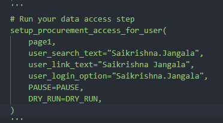
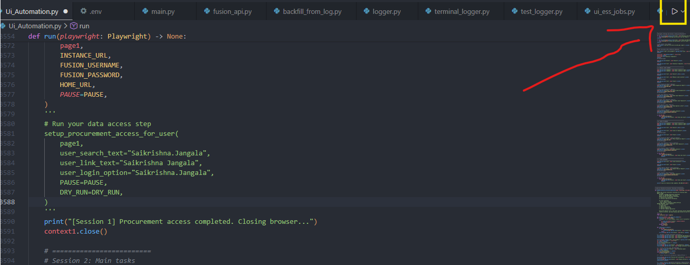
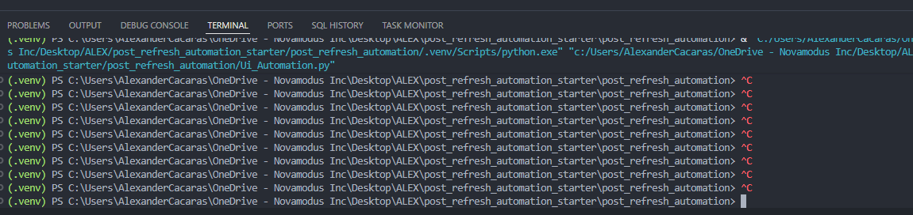
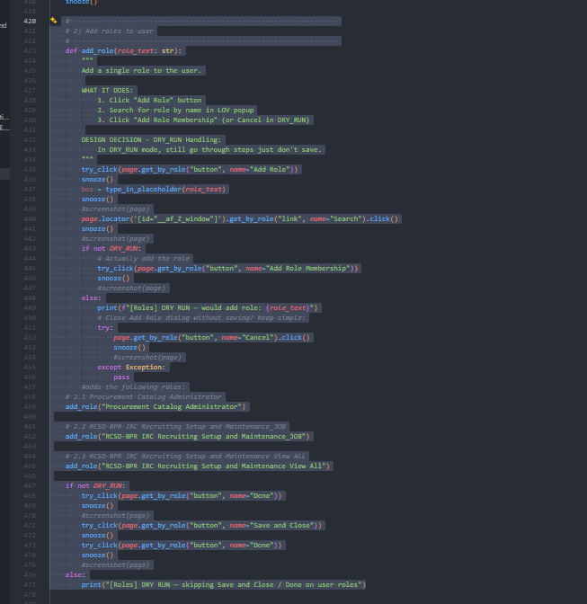
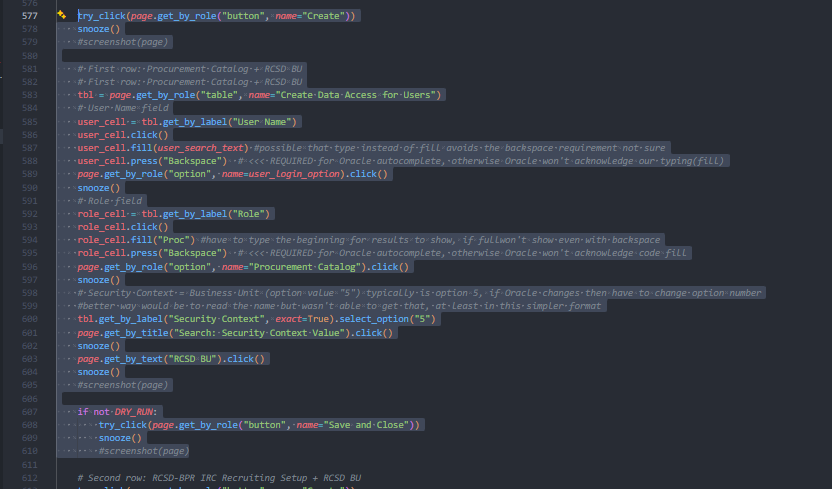
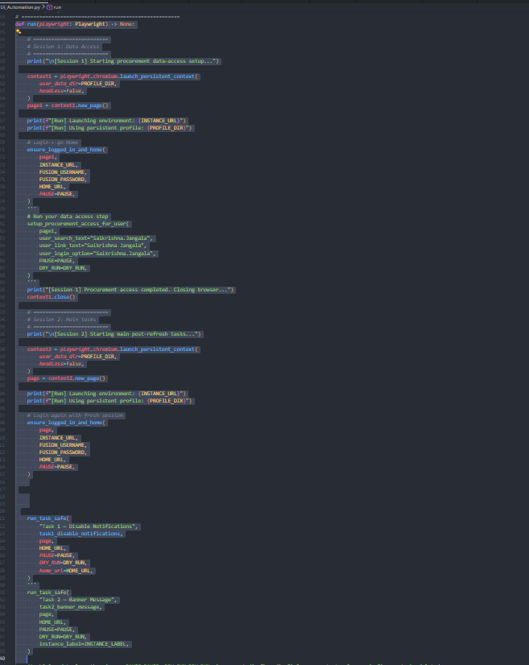
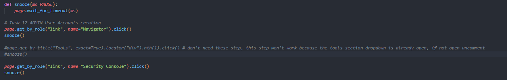
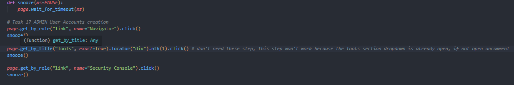
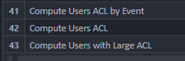
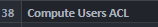

Before starting click on your keyboard ctrl + shift + v
This is a readme file for the flowchart of the P2T refresh jobs. 
====================================================================================================================
It will also contain Images to show examples or where in the code.

# 1. Perform all the required manual tasks, refer to the manual task document not found in the python script folder.
# 2. Before running the python script are all roles added (yes/no) this includes the following:
    - Procurement Catalog Administrator
    - RCSD-BPR IRC Recruiting Setup and Maintenance_JOB
    - RCSD-BPR IRC Recruiting Setup and Maintenance View All
    - DATA ACCESS:
    - Role: Procurement Catalog
    - Role: RCSD-BPR IRC Recruiting Setup
    - PROCUREMENT AGENT ACCESS:
    - Procurement BU: RCSD BU
    - NOTE: Procurement Agent section currently commented out in code assumed to be pre-configured before script runs.

IF YES:
=======
In Ui_Automation.py, go to  setup_procurement_access_for_user task (around line 3581) and please comment it out.
- 
- Then You may run the file Ui_Automation.py
- 

IF NO:
======
Run Ui_Automation.py
- 
# - Please pay attention to the data access task, typically the last row won't save. If it doesn't save do the following:
- Stop the run, one way is in terminal type ctrl c
- 

Two options:
============
# 1.
- At around line 420 comment out this section  
   - #-------------------------------------------------------------------
   - #2) Add roles to user
   - #------------------------------------------------------------------
   - 
   - And the first row for data access around line 577
   - 
   - Then rerun code for Ui_Automation.py
   - 
- IF THIS DOES NOT WORK ADD DATA ACCESS MANUALLY THEN
- In Ui_Automation.py, go to  setup_procurement_access_for_user task (around line 3581) and please comment it out.
- 
- Then You may run the file Ui_Automation.py
- 

# 2. 
- Add data access manually then
In Ui_Automation.py, go to  setup_procurement_access_for_user task (around line 3581) and please comment it out.
- 
- Then You may run the file Ui_Automation.py
- 

# 3. Now you have officially got passed the pre-task section and have started running the code 

# 4. 
- Now that the pretasks are done, you will see the actual UI tasks running, it will run through all task, if it gets stuck it will move to next one.
- After it will star the RESTAPI ESS JOBS 

# 5.
- If the ESS jobs API version failed the script will run the UI_ESS_jobs.py file from the Ui_Automation.py file.
- The UI_ESS_jobs.py is run on the same Excel as the RESTAPI, the ESS jobs will utilize a json for communication between restapi esss jobs file and the ui ess jobs file to check if any jobs were skipped/failed by restapi
- if any jobs were skipped/failed then ui ess jobs will run only the ones that did not succeed.
- Once again, ONLY ONE FILE WILL EVER BE RAN, Ui_Automation.py

# 6.
- Now the script will be done and will close, there will be a few logs you can check to see the results, in terminal_logger.py it will explain how, also if you run this command in terminal with your correct path python terminal_logger.py C:\\Users\\...\\Desktop\\ui_automation_logs\\ui_automation_2026-02-11_17-24-46.db export you will get the export of the logs. 
- You can also check the screenshot folders to see where the failed tasks failed, and you can validate manually in Oracle as well.
- Check to see if any UI tasks failed. Did any fail (Yes/No)

IF YES:
========***
1. - In the run section of the UI_Automation.py comment out all tasks that succeeded except for task 1.
- 
- Then you will with only task 1 + the tasks that failed run Ui_Automation.py again
- 
- Please pay attention to the failed tasks, if it is a task that requires you to open the navigator then a crucial first step will be needed.
- Take task 17 for example
- If it fails because it is looking for the tools button add the line in the screenshot:
- 
- vs
- 

2. - IF THE FAILED TASKS FAIL AGAIN I SUGGEST TO RUN THEM MANUALLY 
- Typically none fail but occasionally 1 does, I run the code I first gave every post refresh and now this 1.0.1 version it runs for every post refresh as well since code is almost same just small changes like this readme, so my suggestion is in terms of time if one tasks fails typically better to run manually or run the code with it and just interfer with the clicks if code seems stuck

IF NO:
=======
- Then the UI tasks are complete if any ESS jobs failed run them manually or run script again then manually and then go to step 7.

# 7.
- IF the UI version of the ESS jobs ran due to RESTAPI version failure then you must manually run the 4 ACL tasks, this is the last step and these must be run last.
- 
- 

# 8.

- From this point you will be done running the automation and/or performing any of the failure fixes/manual runs. 
- You can validate through screenshots or manually if the changes have been made if you want to be extra cautious.
- This will wrap up the Ui Automation for P2T and the P2T work flow. Remember the code is designed in such way only one file ever has to be ran to complete all tasks.